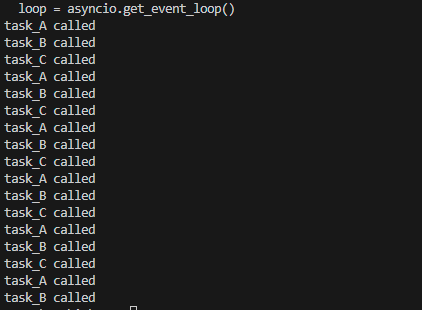

# Chapter 5:
### Topics Covered:
# Multiprocessing Examples in Python

---

## Files Overview

### 1. `asyncio_coroutine.py`
**Description**: Simulates a finite state machine using Python's `asyncio` library.  
**Features**: Implements states (`start_state`, `state1`, `state2`, `state3`, `end_state`) with asynchronous transitions using `yield from`.  

### 2. `asyncio_event_looop.py`
**Description**: Demonstrates an event-driven model with `asyncio`.  
**Features**: Circular scheduling of tasks (`task_A`, `task_B`, `task_C`) with `loop.call_later`. Runs for a defined time (`60 seconds`).  

### 3. `HeavyComputationSimulation.py`
**Description**: Simulates heavy computation using sequential, thread pool, and process pool execution.  
**Features**: Compares execution methods for a computation-heavy task (`count`).  

### 4. `ThreadPoolExecutor.py`
**Description**: Demonstrates task execution with `ThreadPoolExecutor`.  
**Features**: Executes single and multiple tasks with the `cube` function and gracefully shuts down the executor.  

